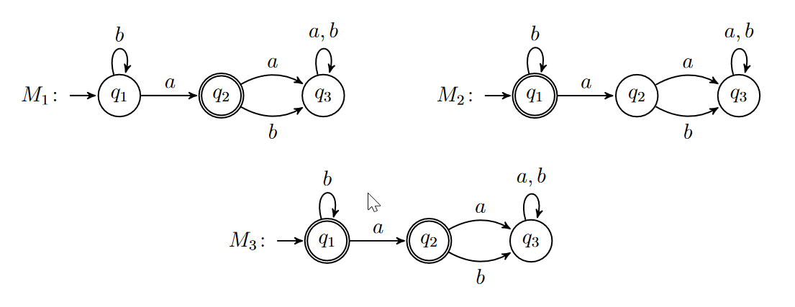

# Exercise 1
Let $L_1 = \{aa, bb, bbb\}$ and $L_2 = \{abba, aab, bb\}$ be two languages over the alphabet Σ = {a, b}.
What are the strings of the following languages?

## 1.
$L_1 \circ L_2$

$L_1 \circ L_2 = \{aaabba, aaaab, aabb, bbabba, bbaab, bbbb, bbbabba,bbbaab, bbbbb\}$ 

## 2.
$L_1 \cup L_2$

$L_1 \cup L_2 = \{aa, bb, bbb, abba, aab\}$

## 3.
$L_1 \cap L_2$

$L_1 \cap L_2 = \{bb\}$

## 4.
Provide a few strings of $L^∗_2$ 

a, b, bba

# Exercise 2
Given the following three automata $M_1$, $M_2$, and $M_3$

## 1.
Describe the sequence of states that $M_1$ goes through while reading the inputs:

a) abbbab
* $q_1 - q_2 - q_3 - q_3 - q_3 - q_3 - q_3 $

b) ababaab
* $q_1 - q_2 - q_3 - q_3 - q_3 - q_3 - q_3 - q_3$

c) aaaaa
* $q_1 - q_2 - q_3 - q_3 - q_3 - q_3$

d) $\varepsilon$
* $q_1$

## 2.
Which of the previous sequences are accepting in $M_1$, $M_2$ and $M_3$?

only d as all the others end in $q_3$ wich is not an accept state in any of the automata

## 3.
Describe the languages recognised by each of the three automata.

$L(M) = \{w |M\ accepts\ a, b\}$

# Exercise 3
Provide the state diagram of the automaton $M_4 = (Q, Σ, δ, q_0, F )$ given below and describe its
language.