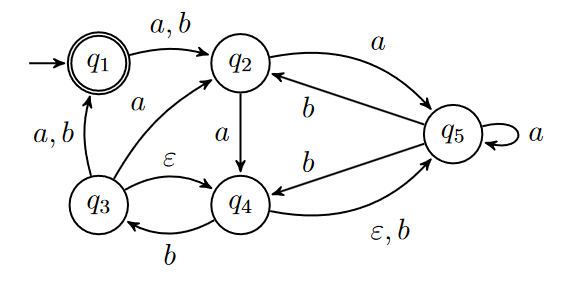
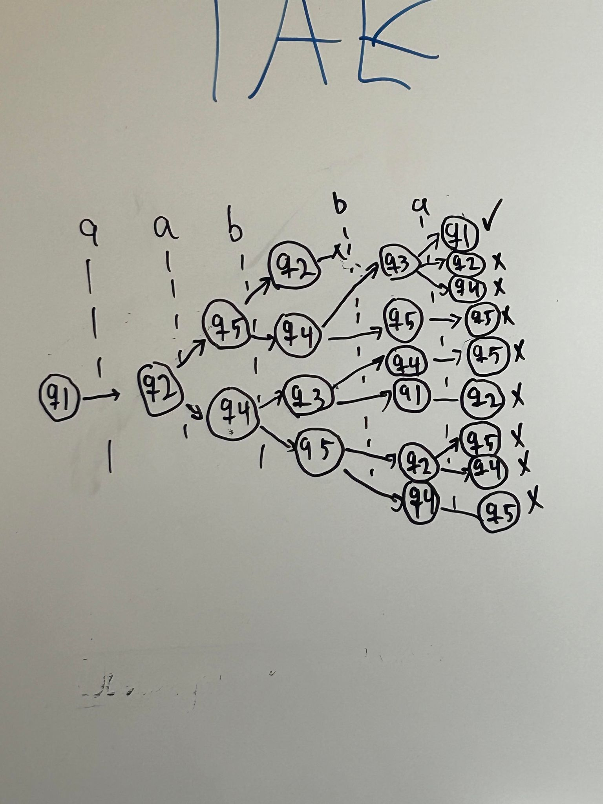
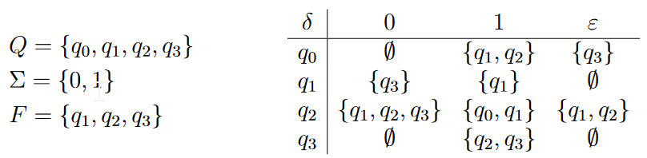

# Exercise 1
The following is the state diagram of the nondeterministic automaton $N_1$.

* Provide the formal description of $N_1$

$L(n_1)=\{w|w_0aw_1bw_2\ w_0\in\{a,b\}\ w_1\in\{a,b\}^*\ w_0\in\{a,b\}\}$

* Which of the following inputs are accepted? When the input is accepted, justify your
answer by providing a corresponding accepting sequence of states in N.

    1. aabba 
    2. abbabb
    3. aaabab
    4. aabbbba

i. and iv. works

* Describe the computation tree of $N_1$ for the input string aabba.

# Exercise 2
Provide the state diagram of the nondeterministic automaton $N_2 = (Q, Σ, δ, q_0, F )$, where

Which of the following inputs are accepted? When the input is accepted, justify your answer
by providing a corresponding accepting sequence of states in $N_2$

1. 0011010
2. 0001110
3. 1010111 accepted
    * $q_0-q_1-q_3-q_2-q_0-q_1-q_1-q_1$
4. 1101011 accepted
    * $q_0-q_1-q_1-q_3-q_2-q_2-q_1-q_1$

# Exercise 3
For each of the following languages, draw the state diagram of an automaton recognizing it.
1. $L_1 = {w ∈ {0, 1}∗ | w = 0^{2n}10101^{3k} for\ n, k ≥ 0}$