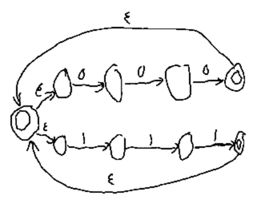
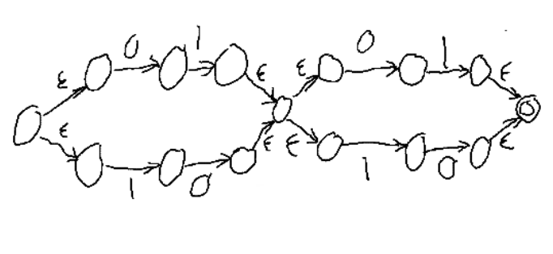
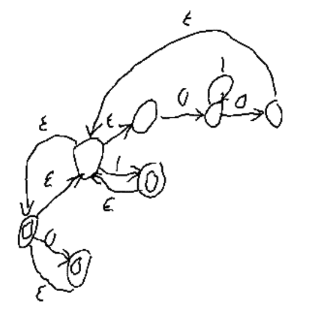
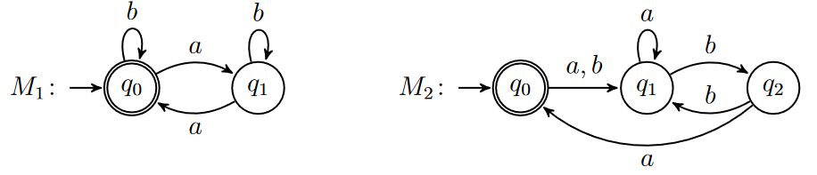
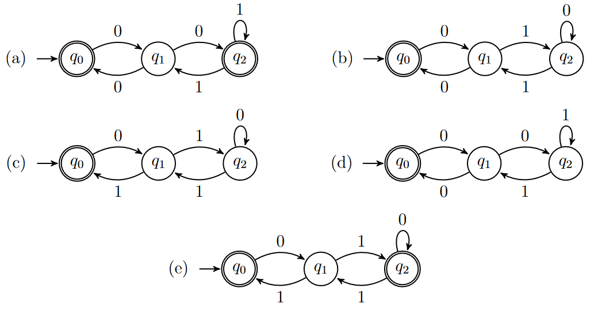

# Exercise 1
Give regular expressions for each of the following languages over $\{a, b\}$.

1. $\{w | w\ contains\ an\ even\ number\ of\ a’s\}$

    $(b^*ab^*ab^*)^*$

2. $\{w | w\ contains\ an\ odd\ number\ of\ b’s\}$

    $a^*ba^* \cup a^*ba^*(a^*ba^*ba^*)^+$

3. $\{w | w\ contains\ an\ even\ number\ of\ a’s\ or\ an\ odd\ number\ of\ b’s\}$

    $((b^*ab^*ab^*)^*) \cup (a^*ba^* \cup a^*ba^*(a^*ba^*ba^*)^+)$

4. $\{w | w\ does\ not\ contain\ the\ substring\ a\}$

    $b^*$

5. $\{w | w\ does\ not\ contain\ the\ substring\ ab\}$

    $b^*a^*$

6. $\{w | w\ does\ not\ contain\ the\ substring\ aba\}$

    $b^*a^*b^*$

# Exercise 2
Covert each of the following regular expressions into equivalent NFAs, i.e., recognising the language of strings represented by the regular expression.

1. $(000∗ ∪ 111∗)∗$

    

2. $(01 ∪ 10)(01 ∪ 10)$

    

3. (0 ∪ 1(01∗0)∗1)∗

    

# Exercise 3
Convert each of the following DFAs into equivalent regular expressions by using the construction described in Lemma 1.60 (M. Sipser, Introduction to the Theory of Computation, 3ed).

Show all of the steps of the conversion.

## $M_1$
$(b^*ab^*a)^*$

## $M_2$
$((a\cup b)a^*b^*a)*$

# Exercise 4
Match each NFA with an equivalent regular expression.

1. $ε ∪ 0(01^∗1 ∪ 00)^∗01^∗$

    a
2. $ε ∪ 0(10^∗1 ∪ 10)^∗10^∗$'

    e
3. $ε ∪ 0(10^∗1 ∪ 00)^∗0$

    b
4. $ε ∪ 0(01^∗1 ∪ 00)^∗0$

    d
5. $ε ∪ 0(10^∗1 ∪ 10)^∗1$

    c

