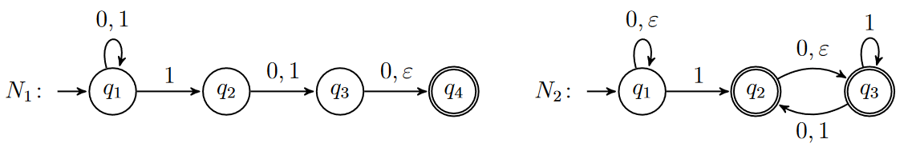

# Exercise 1

Consider the following context-free grammar G

$S → ABS | AB$

$A → aA | a$

$B → bA$

Which of the following strings are in L(G) and which are not? Provide derivations for those that are in L(G) and reasons for those that are not.

1. aabaab
    * Not in L(G)
2. aaaaba
    * Is in L(G)
    * $A \rarr AB \rarr aAB \rarr aaAB \rarr aaaAB \rarr aaaaB \rarr aaaabA \rarr aaaaba$
3. aabbaa
    * Not in L(G)
4. abaaba
    * Is in L(G)
    * $A \rarr ABS \rarr ABAB \rarr aBAB \rarr abAAB \rarr abaAB \rarr abaaB \rarr abaabA \rarr abaaba$

Those that are not in L(G) does not follow the rule that all b's are followed by atleast one a.

# Exercise 2

Give context-free grammars that generate the following languages over $Σ = \{0, 1\}$:

1. $L_1$  = {w | w contains at least three occurrences of 1}
    * $S \rarr A$
    * $A \rarr 0A\ |\ 1B\ |\ 0$
    * $B \rarr 0B\ |\ 1C\ |\ 0$
    * $C \rarr 0C\ |\ 1d\ |\ 0$
    * $D \rarr 0D\ |\ 1D\ |\ 1\ |\ 0$
2. $L_2$ = {w | w starts and ends with the same symbol}
    * $S \rarr 1A\ |\ 0B$
    * $A \rarr 1A\ |\ 0A\ |\ 1$
    * $B \rarr 1B\ |\ 0B\ |\ 0$
3. $L_3$ = {w | the length of w is odd and its middle symbol is 0}
    * $S \rarr A0A$
    * $A \rarr BBB\ |\ B$
    * $B \rarr 0\ |\ 1$
4. $L_4$ = ∅
    * $S \rarr$
    * Unsure how to indicate the empty set
5. $L_5$ = {ε}
    * $S \rarr \epsilon$

# Exercise 3
Give context-free grammars that generate the following languages over $Σ = \{0, 1\}$:

1. $L_6 =\{0^n1^m\ |\ n ≠ m\}$
    * $S \rarr 0A1$
    * $A \rarr 0A1\ |\ 1\ |\ 0$
2. $L_7 = \{w | $ equal occurrences of 0’s and 1’s  $ \}$
    * $S \rarr 0A1\ |\ \epsilon$
3. $L_8 = \{w | $ strictly more occurrences of  0’s than 1’s $\}$
    * $S \rarr 0S1\ ∣\ 0S\ ∣\ 0$
4. $L_9 =\{uv\ |\ |u| = |v|$ and $u ≠ v\}$
    * $S \rarr S_1\ |\ S_2$
    * $S_1 \rarr 1A$
    * $A \rarr 1A\ |\ 0A\ |\ 0\ |\ 1$
    * $S_2 \rarr 0B$
    * $B \rarr 1B\ |\ 0B\ |\ 0\ |\ 1$

## Remarks
Unsure if the solutin to $L_9$ is sufficient, because it requires $S_1$ to start with 1 and $S_2$ to start with 0 not allowing words to start in the same way but end differently.

# Exercise 4

Consider the following context-free grammar G with start variable A.

$A → XAX\ |\ S$

$S → aT b\ |\ bT a$

$T → XT X\ |\ X\ |\ ε$

$X → a\ |\ b$

1. Provide a formal description of G by defining all its components;
    * $G=(V, Σ, R, S)$
        * $V = (A, S, T, X)$
        * $Σ =(a,b,\epsilon)$
        * $R=\{(A,XAX), (A,S),(S,aTb), (S,bTa), (T,XTX), (X,X), (X,epsilon), (X,a), (X,b)\}$
        * $S = A$
2. Give five strings in L(G);
    * $aab$
    * $abb$
    * $baa$
    * $bba$
    * $ab$
3. Give five strings not in L(G);
    * All strings that does not contain  $aab$, $abb$, $baa$, $bba$, $ba$, or $ab$ as  a substring are not included in L(G).
    * $a$
    * $aa$
    * $aaa$
    * $aaaa$
    * $aaaa$
4. Which of the following is a derivation in G?
   * $T ⇒ aba$
        * Is not a derivation
   * $T ⇒^∗ aba$
        * Is a derivation
   * $XXX ⇒^∗ aba$
        * Is a derivation
   * $T ⇒^∗ XX$
        * Is a derivation
   * $T ⇒^∗ XXX$
        * Is a derivation
   * $S ⇒^∗ ε$
        * Is not a derivation

# Exercise 5
Provide context-free grammars equivalent to the following NFAs.

## $N_1$
* $S \rarr q_1 $
* $q_1 \rarr 0q_1\ |\ 1q_1\ |\  1q_2$
* $q_2 \rarr 0q_3\ |\ 1q_3$
* $q_3 \rarr 0q_4\ |\ q_4$
* $q_4 \rarr \epsilon$

## $N_2$
* $S \rarr q_1$
* $q_1 \rarr 0q_1\ |\ q_1\ |\ 1q_2$
* $q_2 \rarr 0q_3\ |\ q_3\ |\ \epsilon$
* $q_3 \rarr 1q_3\ |\ 1q_2\ |\ 0q_2\ |\ \epsilon$

# Exercise 6
Provide context-free grammars equivalent to the following regular expressions.

1. $0^*10^*$
    * $S \rarr A$
    * $A \rarr 0A0\ |\ 1$
2. $1∪0^*∅^*$
    * $S \rarr S_1\ |\ S_2$
    * $S_1 \rarr 1$
    * $S_2 \rarr 0S_2\ |\ 0$
3. $(01^+)^+$
    * $S \rarr (A)S\ |\ (A)$
    * $A \rarr 01A\ |\ 01$

## Remarks
2. unsure how to indicate an arbitrary amount of empty sets.