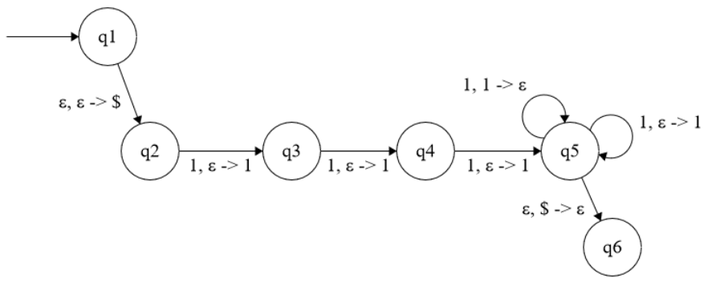

# Exercise 1

Give pushdown automata for each of the following languages over $\Sigma = \{0, 1\}$.

* $L_1 = \{w | w$ contains at least three occurrences of $1s\}$
    * 
* $L_2 = \{w | w$ starts and ends with the same symbol $\}$
    * a
* $L3 = \{w | |w|$ is odd and 0 is its middle symbol $\}$
    * a

# Exercise 2
